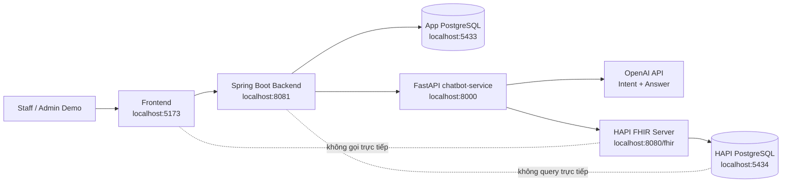
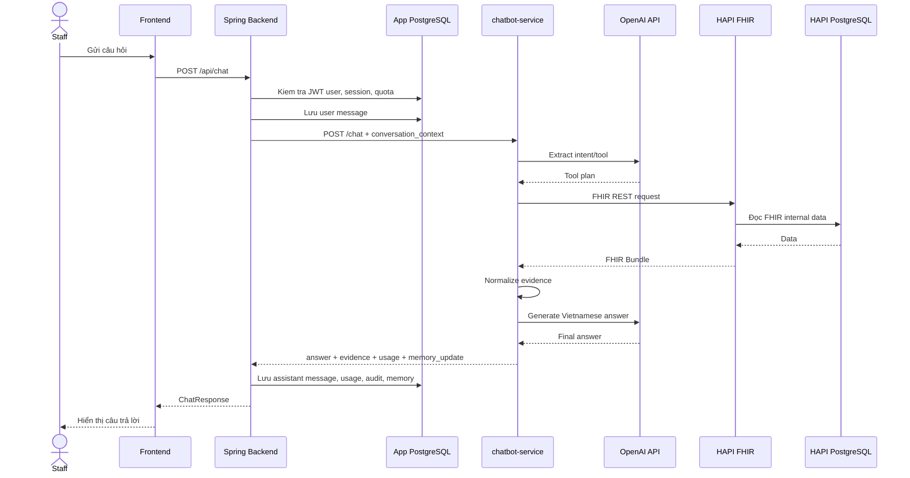

# Medical Chatbot

Medical Chatbot là demo webapp giúp staff/admin y tế tra cứu dữ liệu bệnh nhân bằng ngôn ngữ tự nhiên. Hệ thống được thiết kế quanh FHIR: LLM không sinh SQL và không truy vấn trực tiếp database nội bộ của HAPI FHIR.

## Mục Tiêu

- Tìm kiếm bệnh nhân theo tên, số điện thoại, ngày sinh, identifier hoặc FHIR id.
- Hỏi đáp bằng tiếng Việt về thông tin bệnh nhân.
- Lấy dữ liệu có cấu trúc từ HAPI FHIR qua FHIR REST API.
- Hỗ trợ các FHIR resource demo:
  - `Patient`
  - `Encounter`
  - `Observation`
  - `Condition`
  - `MedicationRequest`
- Lưu lịch sử hội thoại, message và session memory.
- Theo dõi quota, token usage, estimated AI cost và audit log.
- Có dashboard demo cho staff để chọn bệnh nhân, xem hồ sơ tóm tắt và chat theo context bệnh nhân.

## Kiến Trúc Hệ Thống

```text
Staff / Admin Demo
  -> Frontend static HTML/CSS/JS
  -> Spring Boot backend
  -> FastAPI chatbot-service
  -> HAPI FHIR REST API
  -> HAPI PostgreSQL
```

Spring Boot dùng app database riêng:

```text
Spring Boot backend
  -> App PostgreSQL
```

Quy tắc quan trọng:

```text
Dùng FHIR REST API để lấy dữ liệu y tế có cấu trúc.
Không query trực tiếp HAPI PostgreSQL internal tables.
Không để LLM sinh SQL.
```

## Sơ Đồ Tổng Quan



## Workflow Chat



## Cấu Trúc Thư Mục

```text
Medical_Chatbot/
  frontend/
    index.html
    app.js
    styles.css

  spring-backend/
    src/main/java/com/medicalchatbot/backend/
      config/
      controller/
      dto/
        request/
        response/
      entity/
      enums/
      exception/
      mapper/
      repository/
      service/
    src/main/resources/db/migration/

  chatbot-service/
    app/
    api/
    agents/
    fhir/
    tests/

  infra/
    hapi-fhir/
      docker-compose.yml
      config/
      seed/
      scripts/
    app-postgres/
      docker-compose.yml

  logs/
  run-dev.ps1
  AGENTS.md
  MILESTONES.md
```

## Thành Phần Chính

### Frontend

Folder: `frontend/`

Vai trò:

- Staff dashboard demo.
- Tìm kiếm và chọn bệnh nhân.
- Hiển thị lịch sử hội thoại.
- Hiển thị chat area.
- Hiển thị hồ sơ tóm tắt, evidence, token/cost/quota.
- Chỉ gọi Spring backend, không gọi trực tiếp HAPI FHIR.

### Spring Boot Backend

Folder: `spring-backend/`

Vai trò:

- Backend chính của webapp.
- Expose REST API cho frontend.
- Quản lý chat session, messages, session memory.
- Kiểm tra quota trước khi gọi AI.
- Lưu usage logs, audit logs.
- Tính estimated cost dựa trên token và bảng giá model.
- Proxy các endpoint patient/FHIR read sang `chatbot-service`.

Flow code chính:

```text
controller -> service -> repository -> entity -> app database
```

### FastAPI chatbot-service

Folder: `chatbot-service/`

Vai trò:

- Nhận request chat từ Spring.
- Extract intent/tool bằng LLM hoặc rule fallback.
- Gọi HAPI FHIR qua REST API.
- Normalize FHIR response.
- Tạo câu trả lời tiếng Việt bằng LLM hoặc template fallback.
- Trả `answer`, `evidence`, `usage`, `memory_update` về Spring.

### HAPI FHIR

Folder: `infra/hapi-fhir/`

Vai trò:

- FHIR Server R4.
- Source of truth cho dữ liệu y tế có cấu trúc.
- Lưu dữ liệu vào PostgreSQL nội bộ do HAPI quản lý.

### App PostgreSQL

Folder: `infra/app-postgres/`

Vai trò:

- Database riêng của Spring app.
- Lưu user/session/message/usage/quota/cost/audit.
- Không lưu HAPI internal resource tables.

## Yêu Cầu Cài Đặt

Cần có:

- Docker Desktop
- PowerShell
- Python 3.11+ hoặc Python 3.12+
- Java 21
- Git

Maven không cần cài riêng vì Spring dùng Maven Wrapper:

```text
spring-backend/mvnw.cmd
```

## Cấu Hình Môi Trường

### Chatbot Service Env

Tạo file:

```text
chatbot-service/.env
```

Có thể copy từ:

```text
chatbot-service/.env.example
```

Nội dung mẫu:

```env
FHIR_BASE_URL=http://localhost:8080/fhir
FHIR_REQUEST_TIMEOUT_SECONDS=20
APP_NAME=Dịch vụ Chatbot Y tế

LLM_PROVIDER=openai
LLM_MODEL=gpt-4o-mini
OPENAI_API_KEY=replace_me
LLM_REQUEST_TIMEOUT_SECONDS=20
ENABLE_LLM_ANSWER=true
```

Lưu ý:

- Không commit API key thật.
- Nếu không có `OPENAI_API_KEY`, chatbot-service có thể fallback sang rule/template, nhưng sẽ không có LLM answer thật.

### Spring Backend Config

File:

```text
spring-backend/src/main/resources/application.yml
```

Mặc định:

```yaml
server:
  port: 8081

chatbot:
  service:
    base-url: http://localhost:8000
```

App database:

```text
Host: localhost
Port: 5433
Database: medical_chatbot_app
User: app_user
Password: app_password
```

## Chạy Nhanh Toàn Bộ Dự Án

Từ root repo:

```powershell
cd D:\PROGRAMMING\VDT\project\Medical_Chatbot
.\run-dev.ps1
```

Nếu PowerShell chặn script:

```powershell
Set-ExecutionPolicy -Scope Process -ExecutionPolicy Bypass
.\run-dev.ps1
```

Script sẽ tự động:

- Start HAPI FHIR + HAPI PostgreSQL bằng Docker.
- Start App PostgreSQL bằng Docker.
- Đợi HAPI FHIR sẵn sàng.
- Check demo FHIR data.
- Seed FHIR data nếu cần.
- Cài Python dependencies cho chatbot-service.
- Cấu hình Java 21.
- Start chatbot-service port `8000`.
- Start Spring backend port `8081`.
- Start frontend static server port `5173`.
- Chạy smoke test full chat flow qua Spring.

Sau khi chạy thành công:

```text
Frontend:        http://localhost:5173
Spring backend:  http://localhost:8081
chatbot-service: http://localhost:8000
HAPI FHIR:       http://localhost:8080/fhir
```

Dừng stack:

```powershell
.\run-dev.ps1 -Stop
```

Một số option hữu ích:

```powershell
.\run-dev.ps1 -SkipInstall
.\run-dev.ps1 -SkipSeed
.\run-dev.ps1 -SkipFlowCheck
```

Nếu Java 21 nằm ở path khác:

```powershell
.\run-dev.ps1 -JavaHome "C:\Program Files\Java\jdk-21.0.11"
```

## Chạy Thủ Công Từng Phần

### 1. Start HAPI FHIR

```powershell
docker compose -f infra/hapi-fhir/docker-compose.yml up -d
python infra/hapi-fhir/scripts/wait_for_hapi.py
python infra/hapi-fhir/scripts/check_connection.py
```

Nếu chưa có data:

```powershell
python infra/hapi-fhir/scripts/seed_fhir_data.py
python infra/hapi-fhir/scripts/check_connection.py
```

### 2. Start App PostgreSQL

```powershell
docker compose -f infra/app-postgres/docker-compose.yml up -d
```

### 3. Start chatbot-service

```powershell
cd chatbot-service
python -m pip install -r requirements.txt
python -m uvicorn app.main:app --host 127.0.0.1 --port 8000
```

### 4. Start Spring backend

Mở terminal mới:

```powershell
cd spring-backend
$env:JAVA_HOME = "C:\Program Files\Java\jdk-21.0.11"
$env:Path = "$env:JAVA_HOME\bin;$env:Path"
.\mvnw.cmd spring-boot:run
```

### 5. Start frontend

Mở terminal mới:

```powershell
cd frontend
python -m http.server 5173 --bind 127.0.0.1
```

Mở trình duyệt:

```text
http://localhost:5173
```

## Port Và Credential Local

| Service | URL / Host | Credential |
|---|---|---|
| Frontend | `http://localhost:5173` | none |
| Spring backend | `http://localhost:8081` | JWT login required |
| chatbot-service | `http://localhost:8000` | none |
| HAPI FHIR | `http://localhost:8080/fhir` | none |
| App PostgreSQL | `localhost:5433/medical_chatbot_app` | `app_user` / `app_password` |
| HAPI PostgreSQL | `localhost:5434/hapi` | `admin` / `admin` |

Local demo login accounts:

| Username | Password | Role |
|---|---|---|
| `user_demo` | `UserDemo123!` | `USER` |
| `doctor_demo` | `DoctorDemo123!` | `DOCTOR` |
| `admin_demo` | `AdminDemo123!` | `ADMIN` |

## Kết Nối Database Bằng pgAdmin

### App Database

Dùng để xem chat history, quota, usage, audit:

```text
Host: localhost
Port: 5433
Database: medical_chatbot_app
Username: app_user
Password: app_password
```

Bảng chính:

```text
app_users
quota_policies
chat_sessions
chat_messages
usage_logs
audit_logs
model_pricing
cache_entries
```

### HAPI Database

Chỉ dùng để quan sát HAPI internal storage, không viết app logic dựa vào đây:

```text
Host: localhost
Port: 5434
Database: hapi
Username: admin
Password: admin
```

Cần nhớ:

```text
Dùng FHIR API để đọc/ghi FHIR data.
Không query trực tiếp HAPI internal tables trong chatbot/app code.
```

## API Chính

### Spring Backend

Base URL:

```text
http://localhost:8081
```

Endpoints:

```http
GET  /api/health
GET  /api/chatbot/status
GET  /api/patients?name=&phone=&birth_date=&identifier=&limit=
GET  /api/patients/{patientId}
GET  /api/patients/{patientId}/observations?limit=5
GET  /api/patients/{patientId}/conditions?limit=20
GET  /api/patients/{patientId}/encounters?limit=5
GET  /api/patients/{patientId}/medications?limit=20
POST /api/chat
GET  /api/chat/sessions?limit=20
GET  /api/chat/sessions/{sessionId}/messages
GET  /api/quota/status
GET  /api/usage/cost-summary?from=YYYY-MM-DD&to=YYYY-MM-DD
GET  /api/model-pricing
```

Demo chat request:

```powershell
$body = @{
  message = "Bệnh nhân demo-patient-001 đang dùng thuốc gì?"
  patient_id = "demo-patient-001"
} | ConvertTo-Json

Invoke-RestMethod `
  -Uri "http://localhost:8081/api/chat" `
  -Method Post `
  -ContentType "application/json; charset=utf-8" `
  -Body $body
```

### chatbot-service

Base URL:

```text
http://localhost:8000
```

Endpoints:

```http
GET  /health
GET  /fhir/status
GET  /patients?name=&phone=&birth_date=&identifier=&limit=
GET  /patients/{patient_id}
GET  /patients/{patient_id}/observations?limit=5
GET  /patients/{patient_id}/conditions?limit=20
GET  /patients/{patient_id}/encounters?limit=5
GET  /patients/{patient_id}/medications?limit=20
POST /chat
```

### HAPI FHIR

Base URL:

```text
http://localhost:8080/fhir
```

Examples:

```http
GET /fhir/metadata
GET /fhir/Patient/demo-patient-001
GET /fhir/Observation?patient=Patient/demo-patient-001&_sort=-date&_count=5
GET /fhir/Encounter?patient=Patient/demo-patient-001&_sort=-date&_count=5
GET /fhir/Condition?patient=Patient/demo-patient-001
GET /fhir/MedicationRequest?patient=Patient/demo-patient-001
```

## Demo Data

FHIR demo data nằm trong:

```text
infra/hapi-fhir/seed/
```

Seed bằng:

```powershell
python infra/hapi-fhir/scripts/seed_fhir_data.py
```

Kiểm tra:

```powershell
python infra/hapi-fhir/scripts/check_connection.py
```

Demo patient IDs:

```text
demo-patient-001
demo-patient-002
demo-patient-003
demo-patient-004
demo-patient-005
demo-patient-006
```

## Token, Cost Và Quota

Token được lấy từ OpenAI response trong `chatbot-service`:

```text
response.usage.prompt_tokens
response.usage.completion_tokens
```

Sau đó Spring lưu vào `usage_logs`:

```text
input_tokens
output_tokens
llm_provider
llm_model
estimated_cost_usd
latency_ms
status
```

Quota kiểm theo ngày:

```text
daily_request_limit
daily_token_limit
daily_cost_limit_usd
```

Spring sẽ check quota trước khi gọi AI. Nếu vượt quota, API chat bị chặn và audit log ghi `QUOTA_BLOCKED`.

Xem quota:

```http
GET http://localhost:8081/api/quota/status
```

Xem cost summary:

```http
GET http://localhost:8081/api/usage/cost-summary?from=2026-06-10&to=2026-06-10
```

## Session Memory

Mỗi chat session có memory nhẹ trong `chat_sessions`:

```text
active_patient_id
memory_summary
last_intent
last_tool_name
last_resource_type
last_resource_id
```

Mục đích:

- Hiểu các câu hỏi tiếp theo như "bệnh nhân đó", "chỉ số đó", "thuốc đó".
- Không cần gửi toàn bộ lịch sử hội thoại vào LLM.
- Chỉ gửi memory ngắn và một số message gần nhất.

## Chạy Test

### chatbot-service

```powershell
cd chatbot-service
python -m unittest discover tests
```

### Spring backend

```powershell
cd spring-backend
$env:JAVA_HOME = "C:\Program Files\Java\jdk-21.0.11"
$env:Path = "$env:JAVA_HOME\bin;$env:Path"
.\mvnw.cmd test -q
```

### Frontend syntax check

Nếu máy có Node.js:

```powershell
node --check frontend/app.js
```

### FHIR smoke test

```powershell
python infra/hapi-fhir/scripts/check_connection.py
```

## Kiểm Tra Bằng SQL

Kết nối App DB và chạy:

```sql
select * from chat_sessions order by updated_at desc limit 5;
select * from chat_messages order by created_at desc limit 10;
select * from usage_logs order by created_at desc limit 5;
select * from audit_logs order by created_at desc limit 5;
select * from model_pricing order by provider, model;
```

## Troubleshooting

### PowerShell không cho chạy script

```powershell
Set-ExecutionPolicy -Scope Process -ExecutionPolicy Bypass
.\run-dev.ps1
```

### Port bị chiếm

Kiểm tra port:

```powershell
Get-NetTCPConnection -LocalPort 8081 -State Listen
Get-NetTCPConnection -LocalPort 8000 -State Listen
Get-NetTCPConnection -LocalPort 5173 -State Listen
```

Dừng stack:

```powershell
.\run-dev.ps1 -Stop
```

### HAPI FHIR chưa có data

```powershell
python infra/hapi-fhir/scripts/seed_fhir_data.py
python infra/hapi-fhir/scripts/check_connection.py
```

### Spring không start vì sai Java

Kiểm tra:

```powershell
java -version
```

Cần Java 21. Nếu đang trỏ sai JDK:

```powershell
$env:JAVA_HOME = "C:\Program Files\Java\jdk-21.0.11"
$env:Path = "$env:JAVA_HOME\bin;$env:Path"
```

### Chatbot trả lời nhanh bất thường

Có thể đang dùng rule/template fallback thay vì gọi OpenAI. Kiểm tra:

```text
chatbot-service/.env
OPENAI_API_KEY
ENABLE_LLM_ANSWER=true
```

Trong response, xem:

```text
intent_source
answer_source
usage.input_tokens
usage.output_tokens
```

Nếu `answer_source=llm` và token > 0 thì đã gọi LLM.

### Lỗi database khi kết nối pgAdmin

Dùng đúng port:

```text
App DB:  localhost:5433 / medical_chatbot_app / app_user / app_password
HAPI DB: localhost:5434 / hapi / admin / admin
```

Không dùng `postgres/postgres` nếu compose đang cấu hình user/password khác.

## Quy Tắc Phát Triển

- Frontend chỉ gọi Spring backend.
- Spring backend là API chính của webapp.
- chatbot-service phụ trách LLM/FHIR orchestration.
- HAPI FHIR là source of truth cho structured medical data.
- Không query trực tiếp HAPI PostgreSQL internal tables.
- Không commit `.env` có API key thật.
- Cập nhật `MILESTONES.md` mỗi khi hoàn thành milestone/tính năng lớn.
- Cập nhật README nếu đổi port, lệnh chạy, endpoint hoặc kiến trúc.

## Trạng Thái Hiện Tại

Đã có end-to-end demo:

```text
Frontend
  -> Spring Boot backend
  -> FastAPI chatbot-service
  -> LLM intent extraction
  -> FHIR REST retrieval
  -> HAPI FHIR
  -> normalized evidence
  -> LLM Vietnamese answer generation
  -> Spring quota/cost/audit/session persistence
  -> Staff dashboard displays answer and evidence
```

Xem chi tiết tiến độ tại:

```text
MILESTONES.md
```
