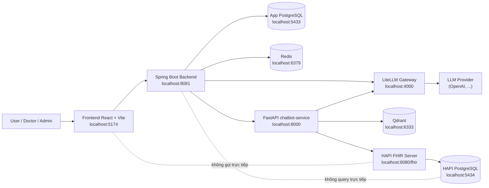
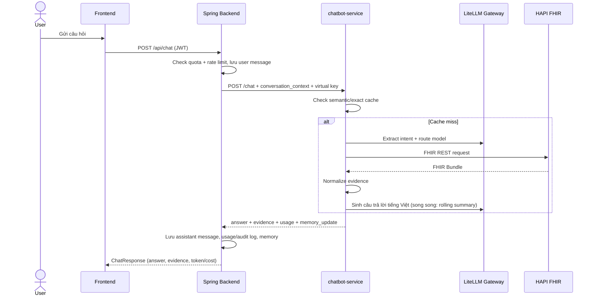

# Medical Chatbot

Medical Chatbot là webapp demo giúp người dùng (bệnh nhân, bác sĩ, admin) tra cứu
dữ liệu y tế bằng ngôn ngữ tự nhiên tiếng Việt. Hệ thống thiết kế quanh **FHIR**:
LLM không sinh SQL, không truy vấn trực tiếp database nội bộ của HAPI FHIR — mọi
dữ liệu y tế đi qua FHIR REST API.

Đề tài trọng tâm: **tối ưu vận hành hệ thống chatbot y tế qua quản lý token,
quota, cache và model routing** — xem `docs/optimization-direction.md`.

## Tính năng chính

- Tìm bệnh nhân theo tên / SĐT / ngày sinh / identifier; hỏi đáp tiếng Việt về
  `Patient`, `Encounter`, `Observation`, `Condition`, `MedicationRequest`.
- Auth JWT (access + refresh token rotation qua Redis), 3 role `USER` /
  `DOCTOR` / `ADMIN`, liên kết tài khoản ↔ FHIR Patient, quên/đổi mật khẩu (OTP email).
- Lịch sử hội thoại, session memory + **rolling summary** (LangGraph) để nén ngữ cảnh.
- **Quota** theo ngày (request / token / cost) + rate limit theo phút; chặn và audit khi vượt.
- **Semantic cache** (Qdrant + embedding đa ngôn ngữ) và exact cache cho câu trả lời.
- **Model routing** (M16): câu đơn giản → model rẻ, phức tạp → model mạnh;
  keyword classifier + LLM Router tùy chọn. **Retry / fallback** khi LLM lỗi (M17).
- **AI Gateway (LiteLLM)**: provider key chỉ nằm ở gateway; Spring cấp virtual key theo user.
- Dashboard admin: quản lý user, quota policy, bảng giá model, chi phí,
  analytics (intent / error / performance), alerts, audit log.
- Thông báo realtime qua SSE; feedback 1–5 sao cho từng câu trả lời.

## Kiến trúc



Quy tắc quan trọng:

```text
Dùng FHIR REST API cho dữ liệu y tế có cấu trúc.
Không query trực tiếp bảng nội bộ HAPI (hfj_*).
Không để LLM sinh SQL.
Provider key LLM chỉ nằm trong LiteLLM gateway.
```

| Service | Thư mục | Vai trò |
|---|---|---|
| Frontend | `frontend-react/` | Chat UI, lịch sử hội thoại, panel bệnh nhân, dashboard admin. Chỉ gọi Spring. |
| Spring Backend | `spring-backend/` | Backend chính: auth, quota, session/message, usage/audit, notifications, virtual key. |
| chatbot-service | `chatbot-service/` | Intent extraction, policy theo role, gọi FHIR, routing, semantic cache, sinh câu trả lời. |
| HAPI FHIR | `infra/hapi-fhir/` | FHIR Server R4 — source of truth dữ liệu y tế. |
| Hạ tầng khác | `infra/` | App Postgres, Redis, Qdrant, LiteLLM — Docker Compose. |

Mỗi service có README/CLAUDE.md riêng với chi tiết API và quy ước.

## Workflow chat



## Yêu cầu cài đặt

- Docker Desktop
- PowerShell
- Python 3.11+
- Java 21 — mặc định tại `C:\Program Files\Java\jdk-21.0.10` (Maven dùng wrapper `mvnw.cmd`, không cần cài Maven)
- Node.js 18+ (frontend)
- Git

## Chạy nhanh toàn bộ dự án

Từ root repo:

```powershell
.\run-dev.ps1
```

Script tự động: bật Docker infra (HAPI FHIR + 2 Postgres + Redis + Qdrant +
LiteLLM), đợi HAPI sẵn sàng, seed FHIR data nếu thiếu, cài Python deps, bật
chatbot-service (8000) → Spring (8081) → frontend (5174), rồi chạy smoke test
luồng chat end-to-end.

```powershell
.\run-dev.ps1 -Stop           # dừng cả stack
.\run-dev.ps1 -SkipInstall    # bỏ qua cài dependency
.\run-dev.ps1 -SkipSeed       # bỏ qua seed FHIR data
.\run-dev.ps1 -SkipFlowCheck  # bỏ qua smoke test
.\run-dev.ps1 -JavaHome "C:\Program Files\Java\jdk-21.0.10"  # nếu JDK ở path khác
```

Nếu PowerShell chặn script:

```powershell
Set-ExecutionPolicy -Scope Process -ExecutionPolicy Bypass
```

Sau khi chạy thành công:

```text
Frontend:        http://localhost:5174
Spring backend:  http://localhost:8081  (Swagger: /swagger-ui/index.html)
chatbot-service: http://localhost:8000  (OpenAPI: /docs)
HAPI FHIR:       http://localhost:8080/fhir
LiteLLM:         http://localhost:4000
```

## Chạy thủ công từng phần

```powershell
# 1. Infra (Docker)
docker compose -f infra/hapi-fhir/docker-compose.yml up -d
docker compose -f infra/app-postgres/docker-compose.yml up -d
docker compose -f infra/redis/docker-compose.yml up -d
docker compose -f infra/qdrant/docker-compose.yml up -d
docker compose -f infra/litellm/docker-compose.yml up -d
python infra/hapi-fhir/scripts/wait_for_hapi.py
python infra/hapi-fhir/scripts/seed_fhir_data.py      # nếu chưa có data

# 2. chatbot-service
cd chatbot-service
python -m pip install -r requirements.txt
python -m uvicorn app.main:app --host 127.0.0.1 --port 8000

# 3. Spring backend (terminal mới)
cd spring-backend
$env:JAVA_HOME = "C:\Program Files\Java\jdk-21.0.10"
$env:Path = "$env:JAVA_HOME\bin;$env:Path"
.\mvnw.cmd spring-boot:run

# 4. Frontend (terminal mới)
cd frontend-react
npm install
npm run dev
```

## Port và credential local

| Service | URL / Host | Credential |
|---|---|---|
| Frontend | `http://localhost:5174` | — |
| Spring backend | `http://localhost:8081` | JWT (login) |
| chatbot-service | `http://localhost:8000` | — |
| HAPI FHIR | `http://localhost:8080/fhir` | — |
| LiteLLM Gateway | `http://localhost:4000` | master key trong `infra/litellm` |
| App PostgreSQL | `localhost:5433/medical_chatbot_app` | `app_user` / `app_password` |
| HAPI PostgreSQL | `localhost:5434/hapi` | `admin` / `admin` |
| Redis | `localhost:6379` | — |
| Qdrant | `localhost:6333` | — |

Tài khoản demo (Flyway seed sẵn):

| Username | Password | Role |
|---|---|---|
| `user_demo` | `UserDemo123!` | `USER` |
| `doctor_demo` | `DoctorDemo123!` | `DOCTOR` |
| `admin_demo` | `AdminDemo123!` | `ADMIN` |

Demo patient IDs (seed FHIR): `BN2026-00001` … `BN2026-00006`.
`user_demo` được liên kết sẵn với `BN2026-00001`.

## Cấu hình môi trường

### chatbot-service

Copy `chatbot-service/.env.example` → `chatbot-service/.env`. Các nhóm chính:

```env
FHIR_BASE_URL=http://localhost:8080/fhir

# Model routing: câu đơn giản → MODEL_SIMPLE, phức tạp → MODEL_COMPLEX
MODEL_SIMPLE=gpt-4o-mini
MODEL_COMPLEX=gpt-4.1-mini
ENABLE_LLM_ROUTER=false            # bật LLM Router lai (M16)

# AI Gateway — đường LLM duy nhất, không gọi provider trực tiếp
LITELLM_BASE_URL=http://localhost:4000
LITELLM_MASTER_KEY=sk-local-dev

# Rolling summary hội thoại (LangGraph)
ENABLE_LLM_SUMMARY=true
SUMMARY_TRIGGER_MESSAGE_COUNT=6
```

Không có master key → chatbot-service fallback sang rule/template (không gọi LLM thật).

### Spring backend

Mặc định trong `spring-backend/src/main/resources/application.yml`, override qua
biến môi trường hoặc file `.env` (JWT secret, mail OTP, LiteLLM master key,
Telegram alert…). Chi tiết xem `spring-backend/README.md`.

### LiteLLM

Provider key (OpenAI…) cấu hình trong `infra/litellm/` — **không** đặt trong
chatbot-service hay Spring. Không commit key thật.

## API chính

Chi tiết đầy đủ xem Swagger của từng service. Tóm tắt:

- **Spring** (`:8081`, prefix `/api`) — `auth/*` (login/register/refresh/OTP),
  `chat` + `chat/sessions/*` (kể cả export, feedback), `patients/*` (proxy FHIR),
  `quota/status`, `usage/cost-summary`, `notifications/*` (SSE),
  `admin/*` (users, quota-policies, model-pricing, costs, analytics, alerts),
  `audit-logs`, `metrics/cache`, `health`.
- **chatbot-service** (`:8000`) — `POST /chat`, `GET /patients*`, `GET /health`,
  `GET /fhir/status`.
- **HAPI FHIR** (`:8080/fhir`) — FHIR REST chuẩn, ví dụ:
  `GET /fhir/Observation?patient=Patient/BN2026-00001&_sort=-date&_count=5`.

Demo chat qua API (cần login lấy token trước):

```powershell
$login = Invoke-RestMethod -Uri "http://localhost:8081/api/auth/login" -Method Post -ContentType "application/json" `
  -Body (@{ username = "user_demo"; password = "UserDemo123!" } | ConvertTo-Json)

Invoke-RestMethod -Uri "http://localhost:8081/api/chat" -Method Post -ContentType "application/json; charset=utf-8" `
  -Headers @{ Authorization = "Bearer $($login.access_token)" } `
  -Body (@{ message = "Bệnh nhân BN2026-00001 đang dùng thuốc gì?"; patient_id = "BN2026-00001" } | ConvertTo-Json)
```

## Token, cost và quota

- chatbot-service trả `usage` (token intent + answer + router + summary) và
  `answer_source` / `routing_source` / `query_complexity` cho từng câu trả lời.
- Spring lưu vào `usage_logs` (token in/out, model, cost ước tính, latency,
  cache hit, saved tokens/cost) — nguồn dữ liệu cho dashboard admin.
- Quota theo ngày (`daily_request_limit`, `daily_token_limit`,
  `daily_cost_limit_usd`) + rate limit/phút, cấu hình theo policy trong
  `quota_policies`. Vượt quota → chat bị chặn, audit log ghi `QUOTA_BLOCKED`.
- Xem nhanh: `GET /api/quota/status`, `GET /api/usage/cost-summary`.

Chỉ số đánh giá trước–sau tối ưu (token, cost, latency, cache hit rate, tỉ lệ
routing model rẻ…) xem `docs/optimization-direction.md`.

## Chạy test

| Service | Lệnh | Thư mục |
|---|---|---|
| Spring | `.\mvnw.cmd test` (cần `JAVA_HOME` = JDK 21) | `spring-backend` |
| chatbot-service | `python -m unittest discover tests` | `chatbot-service` |
| Frontend | `npm run typecheck` | `frontend-react` |
| FHIR smoke | `python infra/hapi-fhir/scripts/check_connection.py` | gốc |

## Troubleshooting

- **PowerShell chặn script** — `Set-ExecutionPolicy -Scope Process -ExecutionPolicy Bypass`.
- **Port bị chiếm** — `Get-NetTCPConnection -LocalPort 8081 -State Listen`; dừng stack bằng `.\run-dev.ps1 -Stop`.
- **HAPI chưa có data** — chạy `python infra/hapi-fhir/scripts/seed_fhir_data.py`.
- **Spring không start vì sai Java** — `java -version` phải là 21; đặt
  `$env:JAVA_HOME = "C:\Program Files\Java\jdk-21.0.10"`.
- **Chatbot trả lời nhanh bất thường / không tốn token** — đang chạy fallback
  rule/template hoặc trúng cache. Kiểm tra `LITELLM_MASTER_KEY`,
  `ENABLE_LLM_ANSWER` trong `chatbot-service/.env`; trong response xem
  `answer_source` (`llm` = có gọi LLM) và `usage`.
- **pgAdmin không kết nối được** — App DB `5433` (`app_user`/`app_password`),
  HAPI DB `5434` (`admin`/`admin`); đừng dùng `postgres/postgres`.

## Quy tắc phát triển

- Frontend chỉ gọi Spring; Spring gọi chatbot-service; chatbot-service gọi FHIR REST.
- Không query trực tiếp bảng nội bộ HAPI (`hfj_*`); không để LLM sinh SQL.
- Schema app DB do Flyway sở hữu — đổi schema = thêm migration `VN__...sql`.
- LLM chỉ trả lời từ evidence đã normalize; câu trả lời cuối là tiếng Việt.
- Không commit `.env` / API key thật.
- Chạy test của service liên quan sau mỗi thay đổi.
- Hoàn thành milestone → cập nhật `MILESTONES.md`; đổi port/lệnh/kiến trúc → cập nhật README.

## Tài liệu

- `docs/product-spec.md` — spec sản phẩm + quy tắc FHIR/RAG/usage/cache đầy đủ.
- `docs/optimization-direction.md` — hướng tối ưu token/quota/cache/routing/gateway + chỉ số đánh giá.
- `docs/M-*.md` — thiết kế từng milestone (LiteLLM gateway, model routing, rolling summary…).
- `MILESTONES.md` — tiến độ chi tiết.
- README riêng của từng service: `spring-backend/README.md`, …
