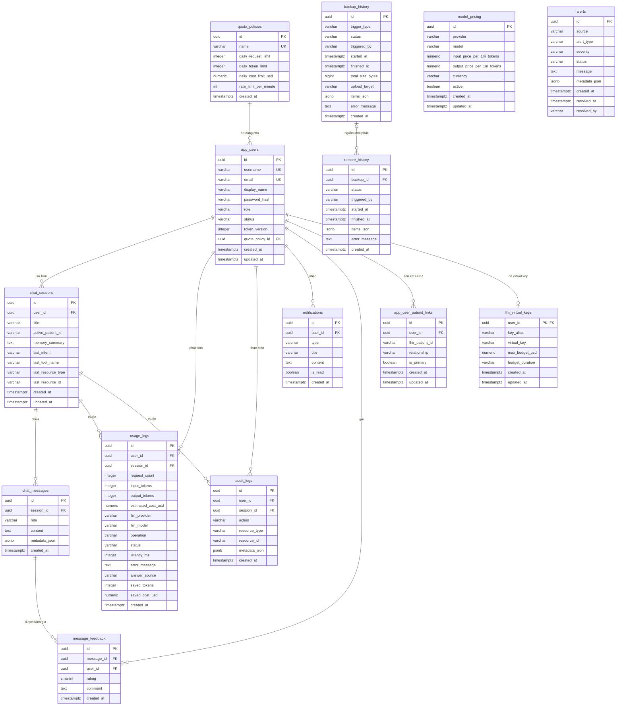

# M12 — Database Design / ERD

Tài liệu này mô tả sơ đồ quan hệ thực thể (ERD) của database ứng dụng
(PostgreSQL), được đối chiếu với Flyway migration V1→V9 trong
[`src/main/resources/db/migration/`](../src/main/resources/db/migration/):

- `V1` là baseline gộp từ 17 migration cũ; `V2` thêm virtual key LiteLLM.
- `V3`→`V4` cập nhật quota policy và dữ liệu hiển thị của user demo.
- `V5` xóa bảng `cache_entries`; semantic cache thực tế nằm trong Qdrant.
- `V6`→`V7` thêm lịch sử backup/restore; `V8` siết unique feedback; `V9`
  vô hiệu hóa credential demo trong production.

Schema cuối có 14 bảng. Profile `dev` nạp thêm
`db/devmigration/R__enable_demo_accounts.sql` để bật lại ba tài khoản demo.

> **Phạm vi**: Đây là DB *ứng dụng*. Dữ liệu lâm sàng của bệnh nhân (Patient,
> Observation, Condition...) **không** lưu ở đây mà nằm trên **HAPI FHIR server**
> (xem [`infra/hapi-fhir/`](../../infra/hapi-fhir/)). Postgres chỉ giữ *liên kết*
> qua `app_user_patient_links.fhir_patient_id`.

---

## 1. Sơ đồ ERD (Mermaid)



> `model_pricing` và `alerts` là các bảng **độc lập** (không có khóa ngoại) nên
> không nối cạnh trong sơ đồ — chúng tham chiếu logic qua giá trị
> (vd `usage_logs.llm_provider/llm_model` ↔ `model_pricing.provider/model`).

---

## 2. File DBML cho dbdiagram.io

Mở <https://dbdiagram.io/d>, dán toàn bộ khối dưới đây để render & export ảnh
(PNG/PDF/SVG). Đã khai báo đầy đủ FK, `Note`, và một số index tiêu biểu.

```dbml
  Table quota_policies {
    id                    uuid       [pk, default: `gen_random_uuid()`]
    name                  varchar    [not null, unique]
    daily_request_limit   integer    [not null]
    daily_token_limit     integer    [not null]
    daily_cost_limit_usd  numeric    [not null]
    rate_limit_per_minute integer    [default: 20]
    created_at            timestamptz [not null, default: `now()`]
    Note: "3 tier seed theo role (V1 baseline, đổi tên ở V3): user_standard (30 req · 50k token · $0.5 · 10 rpm), doctor_standard (200 · 500k · $5 · 30), admin (2000 · 5M · $50 · 120)"
  }

  Table app_users {
    id              uuid        [pk, default: `gen_random_uuid()`]
    username        varchar     [not null, unique]
    email           varchar     [unique]
    display_name    varchar     [not null]
    password_hash   varchar     [not null]
    role            varchar     [not null, default: 'USER']
    status          varchar     [not null]
    token_version   integer     [not null, default: 0]
    quota_policy_id uuid        [ref: > quota_policies.id]
    created_at      timestamptz [not null, default: `now()`]
    updated_at      timestamptz [not null, default: `now()`]
    Indexes {
      quota_policy_id
      `lower(username)` [unique, name: "ux_app_users_username_lower"]
      `lower(email)` [unique, name: "ux_app_users_email_lower", note: "partial: WHERE email IS NOT NULL"]
    }
  }

  Table chat_sessions {
    id                 uuid        [pk, default: `gen_random_uuid()`]
    user_id            uuid        [not null, ref: > app_users.id] // ON DELETE CASCADE
    title              varchar
    active_patient_id  varchar
    memory_summary     text
    last_intent        varchar
    last_tool_name     varchar
    last_resource_type varchar
    last_resource_id   varchar
    created_at         timestamptz [not null, default: `now()`]
    updated_at         timestamptz [not null, default: `now()`]
    Indexes {
      user_id
      (user_id, active_patient_id)
    }
  }

  Table chat_messages {
    id            uuid        [pk, default: `gen_random_uuid()`]
    session_id    uuid        [not null, ref: > chat_sessions.id] // ON DELETE CASCADE
    role          varchar     [not null, note: "CHECK in (user, assistant, system)"]
    content       text        [not null]
    metadata_json jsonb       [not null, default: '{}']
    created_at    timestamptz [not null, default: `now()`]
    Indexes {
      (session_id, created_at)
    }
  }

  Table usage_logs {
    id                 uuid        [pk, default: `gen_random_uuid()`]
    user_id            uuid        [ref: > app_users.id]      // ON DELETE SET NULL
    session_id         uuid        [ref: > chat_sessions.id]  // ON DELETE SET NULL
    request_count      integer     [not null, default: 1]
    input_tokens       integer     [not null, default: 0]
    output_tokens      integer     [not null, default: 0]
    estimated_cost_usd numeric     [not null, default: 0]
    llm_provider       varchar
    llm_model          varchar
    operation          varchar     [not null, default: 'chat']
    status             varchar     [not null, default: 'success', note: "CHECK in (success, failed, fallback, blocked)"]
    latency_ms         integer
    error_message      text
    answer_source      varchar     [default: 'llm']
    saved_tokens       integer     [default: 0]
    saved_cost_usd     numeric     [default: 0]
    created_at         timestamptz [not null, default: `now()`]
    Indexes {
      (user_id, created_at)
      (session_id, created_at)
      (llm_provider, llm_model, created_at)
      (status, created_at)
    }
  }

  Table audit_logs {
    id            uuid        [pk, default: `gen_random_uuid()`]
    user_id       uuid        [ref: > app_users.id]      // ON DELETE SET NULL
    session_id    uuid        [ref: > chat_sessions.id]  // ON DELETE SET NULL
    action        varchar     [not null]
    resource_type varchar
    resource_id   varchar
    metadata_json jsonb       [not null, default: '{}']
    created_at    timestamptz [not null, default: `now()`]
    Indexes {
      (user_id, created_at)
      (session_id, created_at)
      (action, created_at)
    }
  }

  Table notifications {
    id         uuid        [pk, default: `gen_random_uuid()`]
    user_id    uuid        [not null, ref: > app_users.id] // ON DELETE CASCADE
    type       varchar     [not null]
    title      varchar     [not null]
    content    text        [not null]
    is_read    boolean     [not null, default: false]
    created_at timestamptz [not null, default: `now()`]
    Indexes {
      (user_id, is_read)
    }
  }

  Table message_feedback {
    id         uuid        [pk, default: `gen_random_uuid()`]
    message_id uuid        [not null, ref: > chat_messages.id] // ON DELETE CASCADE
    user_id    uuid        [ref: > app_users.id]               // ON DELETE SET NULL
    rating     smallint    [not null, note: "CHECK between 1 and 5"]
    comment    text
    created_at timestamptz [not null, default: `now()`]
    Indexes {
      message_id [name: "idx_message_feedback_message_id"]
    }
    Note: "Không có unique (message_id, user_id); chống trùng do FeedbackService đảm nhiệm ở tầng ứng dụng"
  }

  Table app_user_patient_links {
    id              uuid        [pk, default: `gen_random_uuid()`]
    user_id         uuid        [not null, ref: > app_users.id] // ON DELETE CASCADE
    fhir_patient_id varchar     [not null, note: "ID Patient trên HAPI FHIR"]
    relationship    varchar     [not null, default: 'SELF', note: "CHECK in (SELF, DEPENDENT, CAREGIVER)"]
    is_primary      boolean     [not null, default: false]
    created_at      timestamptz [not null, default: `now()`]
    updated_at      timestamptz [not null, default: `now()`]
    Indexes {
      (user_id, fhir_patient_id) [unique]
      user_id [name: "idx_app_user_patient_links_user"]
      user_id [unique, name: "ux_app_user_patient_links_primary", note: "partial: WHERE is_primary"]
      `lower(fhir_patient_id)` [unique, name: "ux_app_user_patient_links_self_patient_lower", note: "partial: WHERE relationship = 'SELF'"]
    }
  }

  Table model_pricing {
    id                         uuid        [pk, default: `gen_random_uuid()`]
    provider                   varchar     [not null]
    model                      varchar     [not null]
    input_price_per_1m_tokens  numeric     [not null]
    output_price_per_1m_tokens numeric     [not null]
    currency                   varchar     [not null, default: 'USD']
    active                     boolean     [not null, default: true]
    created_at                 timestamptz [not null, default: `now()`]
    updated_at                 timestamptz [not null, default: `now()`]
    Indexes {
      (provider, model) [unique, note: "partial: WHERE active, lower()"]
    }
  }

  Table alerts {
    id            uuid        [pk, default: `gen_random_uuid()`]
    source        varchar     [not null]
    alert_type    varchar     [not null]
    severity      varchar     [not null]
    status        varchar     [not null, default: 'OPEN']
    message       text        [not null]
    metadata_json jsonb       [not null, default: '{}']
    created_at    timestamptz [not null, default: `now()`]
    resolved_at   timestamptz
    resolved_by   varchar
    Indexes {
      (status, created_at)
      (severity, created_at)
      (alert_type, status, created_at)
    }
  }

  Table llm_virtual_keys {
    user_id         uuid        [pk, ref: > app_users.id] // ON DELETE CASCADE
    key_alias       varchar     [not null]
    virtual_key     varchar     [not null]
    max_budget_usd  numeric     [not null]
    budget_duration varchar     [not null, default: '1d']
    created_at      timestamptz [not null, default: `now()`]
    updated_at      timestamptz [not null, default: `now()`]
    Note: "V2 — AI Gateway (LiteLLM) DB-backed: ánh xạ app_user → virtual key; gateway là nguồn chặn budget token/cost, bảng này chỉ lưu mapping + budget"
  }

  Table backup_history {
    id               uuid        [pk, default: `gen_random_uuid()`]
    trigger_type     varchar     [not null, note: "AUTO | MANUAL"]
    status           varchar     [not null, default: 'RUNNING']
    triggered_by     varchar
    started_at       timestamptz [not null, default: `now()`]
    finished_at      timestamptz
    total_size_bytes bigint
    upload_target    varchar
    items_json       jsonb       [not null, default: '[]']
    error_message    text
    created_at       timestamptz [not null, default: `now()`]
    Indexes {
      created_at [name: "idx_backup_history_created_at"]
    }
  }

  Table restore_history {
    id            uuid        [pk, default: `gen_random_uuid()`]
    backup_id     uuid        [ref: > backup_history.id, note: "ON DELETE SET NULL"]
    status        varchar     [not null, default: 'RUNNING']
    triggered_by  varchar
    started_at    timestamptz [not null, default: `now()`]
    finished_at   timestamptz
    items_json    jsonb       [not null, default: '[]']
    error_message text
    created_at    timestamptz [not null, default: `now()`]
    Indexes {
      created_at [name: "idx_restore_history_created_at"]
    }
  }
```

---

## 3. Data dictionary — bảng ↔ module

| # | Bảng | Module liên quan | Vai trò |
|---|------|------------------|---------|
| 1 | `quota_policies` | M9 Quota, M10 Rate Limit | Định nghĩa hạn mức ngày + rate limit/phút |
| 2 | `app_users` | M1 Auth/RBAC | Tài khoản, vai trò, mật khẩu (bcrypt), trạng thái |
| 3 | `chat_sessions` | M2, M15 Context | Phiên hội thoại + bộ nhớ ngữ cảnh (`memory_summary`, `last_*`) |
| 4 | `chat_messages` | M3 History | Từng tin nhắn user/assistant/system |
| 5 | `usage_logs` | M7, M8, M11, M14 | Token, chi phí, latency, status, nguồn trả lời (cache/llm) |
| 6 | `audit_logs` | M18 Audit Log | Nhật ký hành động nghiệp vụ |
| 7 | `notifications` | M25 Notification | Thông báo gửi tới user |
| 8 | `message_feedback` | M22 Feedback | Đánh giá 1–5 sao + bình luận cho 1 tin nhắn |
| 9 | `app_user_patient_links` | M4, M5 FHIR | Nối user ↔ Patient ID trên HAPI FHIR |
| 10 | `model_pricing` | M8 Cost, M16 Routing | Bảng giá token theo provider/model |
| 11 | `alerts` | M19 Alert | Cảnh báo sự cố hệ thống + trạng thái xử lý |
| 12 | `llm_virtual_keys` | AI Gateway (LiteLLM) | Ánh xạ user ↔ virtual key + budget trên gateway |
| 13 | `backup_history` | M26 Backup | Trạng thái và kết quả từng lần sao lưu |
| 14 | `restore_history` | M26 Restore | Lịch sử khôi phục, có thể tham chiếu bản backup nguồn |

---

## 4. Quy ước thiết kế (rút ra từ schema)

- **Khóa chính**: `uuid` + `gen_random_uuid()` cho mọi bảng
  (ngoại lệ: `llm_virtual_keys` dùng thẳng `user_id` làm PK — quan hệ 1–1 với `app_users`).
- **Thời gian**: `timestamptz` + `default now()`.
- **Xóa dữ liệu**:
  - Quan hệ sở hữu (con không tồn tại độc lập) → `ON DELETE CASCADE`
    (`chat_messages`, `notifications`, `app_user_patient_links`...).
  - Quan hệ tham chiếu cần giữ lịch sử → `ON DELETE SET NULL`
    (`usage_logs`, `audit_logs`, `message_feedback.user_id`).
- **Toàn vẹn dữ liệu**: dùng `CHECK` cho enum (role, status, relationship,
  rating), `UNIQUE` cho khóa nghiệp vụ.
- **Tiền/token**: luôn dùng `numeric` (không dùng float).
- **Index**: đặt trên FK + cột thường lọc/sắp xếp, ưu tiên composite khớp pattern
  truy vấn (vd `(session_id, created_at)`).
- **Migration**: mỗi thay đổi = 1 file `V{n}__*.sql` mới, không sửa file cũ.
